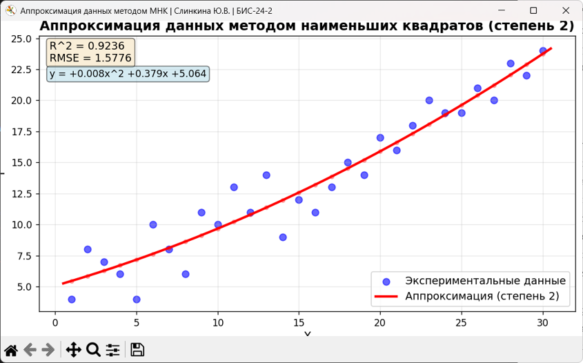

# Аппроксимация данных методом наименьших квадратов



**Выполнила:** Слинкина Ю.В.  
**Группа:** БИС-24-2

## Описание программы

Программа реализует аппроксимацию экспериментальных данных методом наименьших квадратов (МНК) с использованием полиномов различных степеней. Предназначена для анализа зависимостей между переменными, построения аппроксимирующих кривых и оценки качества подгонки.

### Основные возможности

- Загрузка данных из CSV-файла (формат: колонки `x` и `y`)
- Аппроксимация полиномом степени от 1 до 10
- Сравнение качества аппроксимации для разных степеней полинома
- Вычисление метрик качества: R², RMSE, MSE
- Визуализация экспериментальных данных и аппроксимирующей кривой
- Отображение уравнения полинома на графике

## Установка и запуск

### Локальный запуск

Установите зависимости:
```bash
pip install -r requirements.txt

# Запустите программу
python Slinkina_YU_V_BIS_24_2.py
```

### Запуск через Docker

1. Собрать образ:
```bash
docker build -t mnk-approximation .

# Запустить контейнер
docker run -it --rm mnk-approximation
```

2. Или использовать Docker Compose:
```bash
docker-compose up
```

## Тестирование
```bash
# Юнит-тесты
python -m unittest test_unit.py -v

# Интеграционные тесты
python -m unittest test_integration.py -v
```